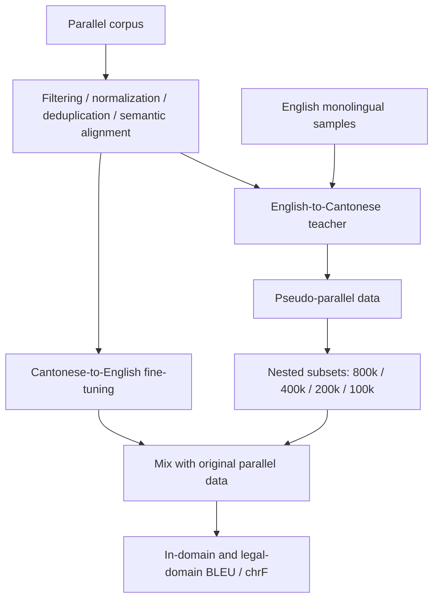

# Experiment guide

This guide summarizes the collaborative Cantonese–English study associated with [ICRAI 2025, DOI 10.1109/ICRAI68431.2025.11396704](https://doi.org/10.1109/ICRAI68431.2025.11396704). It was checked against the local English manuscript and experiment records. It is a reading guide, not a reproduction claim or an executable training recipe.

## Workflow

## Documented configuration

| Item | Manuscript description |
| --- | --- |
| Base model | NLLB-200-distilled-600M |
| Fine-tuning | Full-parameter fine-tuning using Hugging Face Seq2SeqTrainer |
| Optimizer | adamw_torch_fused |
| Initial learning rate | 2e-5 |
| Schedule | Linear schedule with warmup |
| Sampling | Nested pseudo-data subsets from 800k down to 100k |
| Best reported mixture | 200k pseudo pairs + 200k original pairs |

Exact run-specific warmup steps, dependency versions, split hashes, random seeds and saved checkpoint identities are not released here. Do not interpret the table as enough to reproduce the paper. Early exploratory notes used smaller datasets; they are not interchangeable with the paper's final corpus.

## Reported result summary

The machine-readable [result summary](../results/reported-results.csv) contains the three headline metrics already described in this companion. They are reported study results, not fresh measurements. A BLEU difference is only meaningful when dataset, translation direction, preprocessing and evaluation settings are matched.

## Reproduction checklist

A future reproducible release would need dataset access instructions and redistribution terms, deterministic split and sample indices, the complete training/generation configuration, checkpoint provenance and the evaluation library versions/signatures. Until then, use this repository to understand the study and consult the paper for its claims.

## Attribution

Archived BLEU and chrF utility files identify Hugging Face Evaluate as their source. They are third-party metric implementations, not original algorithms from this project, and are not duplicated here. The study's contribution is its data preparation, adaptation and experiments. Source books, third-party corpora and private training records are not redistributed.
